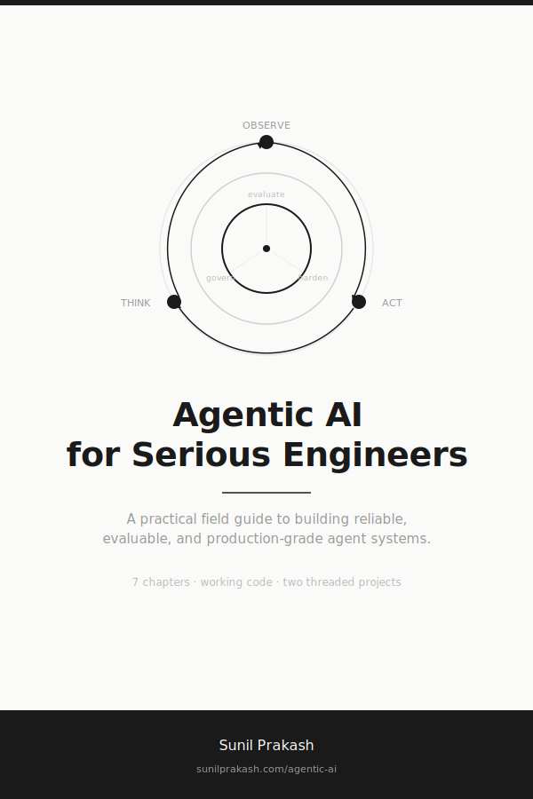

# Agentic AI for Serious Engineers

<p align="center">
  
</p>

<p align="center">
  <a href="https://sunilprakash.com/agentic-ai/"></a>
  <a href="https://creativecommons.org/licenses/by-nc-sa/4.0/"></a>
</p>

**A practical field guide to building reliable, evaluable, and production-grade agent systems.**

**[Read the book free online](https://sunilprakash.com/agentic-ai/)**

---

Most agentic AI content teaches you how to build a flashy demo. This book teaches you what breaks when you ship one.

**Start here in 15 minutes:** read [Chapter 7: When Not to Use Agents](https://sunilprakash.com/agentic-ai/book/07-when-not-to-use-agents/). It is the most valuable chapter because it saves you from building the wrong thing. Then work forward from [Chapter 1](https://sunilprakash.com/agentic-ai/book/01-what-agentic-means/).

**Or run the code:**
```bash
make install && make test && make run
```

## What This Is

Seven chapters, two end-to-end projects, 52+ passing tests, and working Python code for every concept. Not a tutorial. A field manual for engineers building agent systems that need to survive unclear requirements, bad tool outputs, partial failures, prompt injection, and cost pressure.

## Who This Is For

Backend engineers, platform engineers, staff+ engineers, software architects, technical leads, and data engineers building AI systems for production use.

**Assumed baseline:** You know APIs, Python, software architecture, services, testing, and databases. You have built production systems and understand why they break.

**Not assumed:** Transformers in depth, embeddings and retrieval, agent orchestration, AI evaluation, agent governance. These are taught here.

## Who This Is Not For

If you are looking for a prompt engineering tutorial, a framework crash course, or a breathless argument that agents will change everything -- this is not that. If you want to build demos that impress at a meetup but fail in production, there are faster options elsewhere.

## What This Repo Teaches

- When to build an agent and when not to (the decision that matters most)
- Precise definitions: LLM app vs workflow vs tool-using system vs agent
- Tool design as typed contracts with validation, permissions, and error handling
- Context engineering: system prompts, retrieval context, grounding, injection boundaries
- The observe-think-act loop and what makes it work or fail
- Workflow-first architecture: building the same system both ways and comparing
- State management, planning, and uncertainty-based escalation
- Evaluation harnesses: gold datasets, rubric scoring, failure bucketing
- Reliability engineering: retries, checkpointing, crash recovery, cost profiling
- Security hardening: prompt injection, tool abuse, data exfiltration, least privilege
- Observability: structured traces, token accounting, latency decomposition
- Engineering judgment: knowing when simpler architectures win

## What Makes It Different

**Engineering-first.** Every topic starts with the engineering reason it matters. Not "here is the API" but "here is the problem this solves and here is what breaks when you get it wrong."

**Judgment-heavy.** The most valuable chapter teaches you when NOT to build an agent. Most material skips this because it is harder to write and less exciting to market. It is also the chapter that will save you the most time and money.

**Production-aware.** Evaluation, reliability, cost, security, and observability are not appendix topics. They are woven through every chapter because that is how production engineering works.

**Framework-neutral.** Concepts are taught through raw implementations, minimal custom orchestration, and selected frameworks. You learn ideas that survive tool churn, not one vendor's ecosystem.

**Deep but focused.** Seven chapters, not twenty. Each one is dense enough to re-read and find something new. No filler sections, no padding, no "hello world" warmups.

**Serious examples.** The running project has four layers, real failure modes, two implementations of the same task, an eval harness with gold data, and an honest retrospective on which parts actually needed agent autonomy.

## Projects

**Document Intelligence Agent** -- built incrementally across Chapters 1-3 and 6-7. Ingests documents, answers questions with citations, and knows when it does not have enough evidence to answer.

**Incident Runbook Agent** -- introduced in Chapters 4-5. Inspects signals, searches runbooks, proposes remediation steps, and requests human approval before acting.

## Learning Paths

| Path | Goal | Chapters |
|------|------|----------|
| **Fast Engineer** | Build something this week with clear tradeoffs | 1, 2, 7 |
| **Full Mastery** | Understand every layer from concepts through hardening | 1, 2, 3, 4, 5, 6, 7 |
| **Enterprise Architect** | Evaluate agentic patterns for a team or organization | 1, 3, 4, 5, 6, 7 |

## Chapters

| # | Title | Focus |
|---|-------|-------|
| 1 | What "Agentic" Actually Means | Definitions, comparison table, decision map |
| 2 | Tools, Context, and the Agent Loop | Tool registry, context pipeline, first working agent |
| 3 | Workflow First, Agent Second | Same task two ways -- the key architectural decision |
| 4 | Multi-Agent Systems Without Theater | Coordination patterns that solve real problems, not demos |
| 5 | Human-in-the-Loop as Architecture | Approval gates, escalation policy, and audit trails |
| 6 | Evaluating and Hardening Agents | Eval, tracing, reliability, cost, security |
| 7 | When Not to Use Agents | The signature chapter -- building engineering judgment |

## Repo Structure

```
agentic-ai/
├── docs/                          # MkDocs Material site source
│   └── book/                      # Field manual chapters (structured markdown)
│       ├── 01-what-agentic-means.md
│       ├── 02-tools-context-agent-loop.md
│       ├── 03-workflow-first-agent-second.md
│       ├── 04-multi-agent-without-theater.md
│       ├── 05-human-in-the-loop.md
│       ├── 06-evaluating-and-hardening.md
│       └── 07-when-not-to-use-agents.md
├── src/                           # Working examples, per-chapter
│   ├── shared/                    # Model client, config, common types
│   ├── ch02/                      # Tool registry, context pipeline, first agent
│   ├── ch03/                      # Workflow vs agent comparison, state, planning
│   ├── ch04_multiagent/           # Multi-agent contracts, agents, orchestrator
│   ├── ch05_hitl/                 # Approval gates, escalation, audit logging
│   └── ch06/                      # Eval harness, traces, reliability, security
├── project/                       # Threaded end-to-end projects
│   ├── doc-intelligence-agent/    # Ingestion, retrieval, citations, escalation
│   └── incident-runbook-agent/    # Multi-agent with human approval
├── tests/
│   ├── unit/                      # Component-level tests
│   └── integration/               # Pipeline and system tests
├── diagrams/
│   └── source/                    # Architecture-grade SVG diagrams
├── pyproject.toml                 # Dependencies (single source of truth)
├── Makefile                       # install, test, eval, run, compare, serve
├── .env.example                   # Required environment variables
├── PRINCIPLES.md                  # Engineering principles
├── ROADMAP.md                     # What shipped, what is next
└── LICENSE                        # CC BY-NC-SA 4.0
```

## Getting Started

```bash
# Install
make install

# Run tests (52+ passing)
make test

# Run the Document Intelligence Agent
make run

# Run the eval harness
make eval
```

Copy `.env.example` to `.env` and add your API key before running.

## Principles

This repo follows eight engineering principles that shape every chapter, every code example, and every design decision. Read them: [PRINCIPLES.md](PRINCIPLES.md).

## Roadmap

Phase 1 and Phase 2 are shipped. Seven chapters, two end-to-end projects, 52+ passing tests, and a live MkDocs site. Phase 3 covers advanced topics. Read the details: [ROADMAP.md](ROADMAP.md).

## Contributing

Found something wrong or have a suggestion? [Open an issue](https://github.com/sunilp/agentic-ai/issues) or submit a pull request. If this book helped you build something real, consider giving it a star -- it helps others find it.

## Author

Written by [Sunil Prakash](https://sunilprakash.com) -- engineering leader focused on enterprise AI systems, governance, and agent architecture.

## License

[CC BY-NC-SA 4.0](https://creativecommons.org/licenses/by-nc-sa/4.0/). Free to read, share, and adapt with attribution. Commercial use requires permission.
