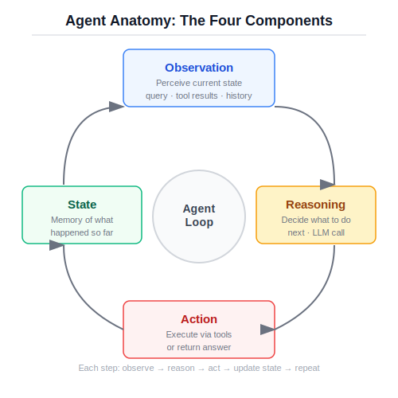
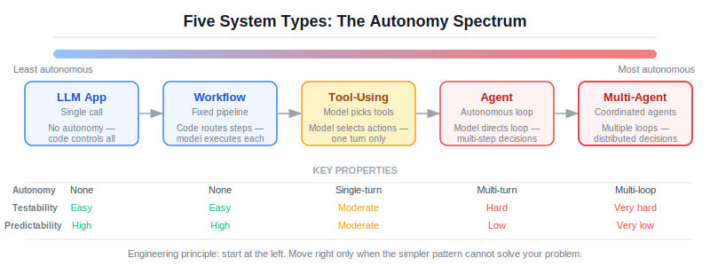

# Chapter 1: What "Agentic" Actually Means

## Why this matters

The word "agent" is used to describe everything from a chatbot with a system prompt to a multi-model orchestration system that autonomously manages infrastructure. This is not just a naming problem. When a term means everything, it means nothing, and engineering decisions based on ambiguous terminology produce ambiguous systems.

The cost of this ambiguity is concrete. Teams build agents when they need workflows. They build multi-agent systems when a single tool-using loop would suffice. They add autonomy to systems that need predictability. And they do this not because they lack skill, but because the vocabulary they are working with does not help them distinguish between fundamentally different system shapes.

This chapter establishes precise definitions. Not to be pedantic, but because the architectural choice between these patterns is the most consequential decision you will make in an LLM-powered system. Get it right and you have a system that is testable, cost-efficient, and appropriately scoped. Get it wrong and you have an expensive, unpredictable black box that everyone is afraid to touch.

## The five system types

There are five distinct patterns for building systems that use large language models. They differ in how much autonomy the system has, how decisions are made, and where things break.

### 1. LLM Application

An LLM application is a system where a language model provides a single response to a single request. There is no looping, no tool use, and no decision-making by the model beyond generating text.

Examples: a summarization endpoint, a classification service, a text-to-SQL translator. You send input, you get output, you are done.

The model's role is generation. The system's control flow is entirely in your code. If the output is bad, you adjust the prompt or the input preprocessing. There is exactly one LLM call per request.

**Failure surface:** Prompt sensitivity, output format instability, hallucination within the response. These are containable because the blast radius is a single response.

### 2. Workflow

A workflow is a deterministic sequence of steps where some steps involve LLM calls. The key property: the control flow is fixed. Step A always happens before Step B. The code decides what happens next, never the model.

Examples: a RAG pipeline (retrieve, then generate), an extraction pipeline (parse, then extract, then validate), a content pipeline (draft, then review, then format).

The model's role is execution within each step. Between steps, your code handles routing, error checking, and data transformation.

**Failure surface:** Each LLM step can fail independently. But because the control flow is fixed, you can test each step in isolation, add retries at specific points, and reason about the system's behavior without guessing what path it took.

### 3. Tool-using system

A tool-using system gives the model access to functions it can call. The model decides which tools to call and with what arguments, but within a single turn. There is no multi-step reasoning loop -- the model gets one chance to select and invoke tools.

Examples: a chatbot with access to a calculator and a search API, a coding assistant that can run tests, a support system that can look up customer records.

The model's role expands to include action selection. It is no longer just generating text; it is making decisions about what to do. This is a meaningful step up in complexity and failure surface.

**Failure surface:** Everything from LLM applications, plus: tool argument hallucination (the model invents parameter values), unnecessary tool calls (the model calls tools it does not need), and tool selection errors (the model picks the wrong tool for the task).

### 4. Agent

An agent is a system where the model participates in a loop, making decisions at each iteration about what to do next based on what it has observed so far. The defining characteristic is the loop: observe the current state, decide on an action, execute it, observe the result, and repeat.

This is where autonomy enters the picture. The model is not just executing a fixed plan. It is deciding, at each step, whether to gather more information, call a tool, refine its approach, or produce a final answer. The control flow is no longer fully in your code.

Examples: a research agent that searches, reads, searches again based on what it found. A document analysis agent that retrieves evidence, decides if it is sufficient, and either answers or refines its query.

**Failure surface:** Everything from tool-using systems, plus: unbounded loops (the agent keeps going without converging), budget exhaustion (the agent runs out of steps before reaching an answer), compounding errors (each step's mistakes feed into the next step's context), and the fundamental unpredictability of having a probabilistic system make control-flow decisions.

<figure>
  
  <figcaption>Figure 1.1: Agent Anatomy -- the four components of the agent loop</figcaption>
</figure>

### 5. Multi-agent system

A multi-agent system involves multiple agents that communicate, delegate, or coordinate to accomplish a task. Each agent has its own loop, its own tools, and its own scope of responsibility.

Examples: a system where a planning agent breaks down a task and delegates subtasks to specialist agents, a peer review system where one agent drafts and another critiques.

**Failure surface:** Everything from single agents, multiplied by the number of agents, plus: coordination failures (agents work at cross purposes), delegation errors (the wrong agent gets the wrong subtask), communication overhead (agents spend tokens talking to each other rather than solving the problem), and emergent behaviors that no individual agent was designed to produce.

## Comparison table

| Property | LLM App | Workflow | Tool-using | Agent | Multi-agent |
|----------|---------|----------|------------|-------|-------------|
| **Autonomy** | None | None | Single-turn | Multi-turn loop | Multi-loop, multi-actor |
| **Decision-making** | None | Code only | Model selects tools | Model controls loop | Models coordinate |
| **Control flow** | Fixed | Fixed | Fixed with model-selected actions | Model-directed | Distributed |
| **LLM calls** | 1 | N (fixed) | 1-2 | Variable | Variable x agents |
| **Failure surface** | Small | Medium | Medium-large | Large | Very large |
| **Testability** | Easy | Easy | Moderate | Hard | Very hard |
| **Cost predictability** | High | High | Moderate | Low | Very low |
| **When to use** | Single transform | Multi-step, predictable | Action selection, single turn | Open-ended, multi-step | Genuinely separable concerns |

Read this table from left to right as a spectrum of increasing autonomy, increasing capability, and increasing risk. The engineering challenge is to pick the point on this spectrum that is far enough right to solve your problem and no further.

<figure>
  
  <figcaption>Figure 1.2: System Types Spectrum -- from LLM apps to multi-agent systems</figcaption>
</figure>

## Bounded autonomy

The concept that makes agents practical in production is bounded autonomy. Unbounded autonomy -- "do whatever you think is best until you are done" -- is not an engineering pattern. It is a hope. And in production, hope is not a strategy.

Consider what happens without bounds. You deploy an agent that can search documents, call APIs, and generate reports. A user sends a tricky query. The agent searches, finds partial results, searches again with a refined query, finds more partial results, tries a third approach, calls an extraction tool, gets an error, retries, searches yet again. Twenty model calls later, it produces an answer that is no better than what it had after the second call. It burned $0.15 in tokens, took 45 seconds, and the user has already given up and called a human.

This is not a theoretical failure mode. It is the default behavior of an agent without bounds. Language models do not have an inherent sense of diminishing returns. They will keep working -- keep consuming tokens, keep adding latency -- because their training rewarded being thorough, not being efficient.

Bounded autonomy means the agent operates within explicit constraints:

**Iteration budget.** The agent has a maximum number of steps. When the budget is exhausted, it must produce the best answer it has and explain what it could not complete. This is not a limitation -- it is a design requirement. An agent without a budget is a runaway process. In our Document Intelligence Agent, the budget is 5 steps. This was chosen empirically: for this task and this document corpus, additional steps beyond 5 rarely improve the answer. Your number will differ. Choose it with data, not intuition.

**Action space.** The agent can only use tools that are explicitly registered and validated. It cannot invent new capabilities. The action space is enumerable, which means it is auditable. In our system, the action space is four tools (load, chunk, retrieve, extract) plus the action of producing a final answer. Five possible actions at each step. This is small enough that a human reviewer can understand every possible path the agent might take.

A larger action space is not always better. Each additional tool increases the probability that the model picks the wrong one. It also increases the surface area for tool-argument hallucination. Design the action space to include exactly what the agent needs and nothing more.

**Stop conditions.** The agent has explicit criteria for when to stop: confidence above a threshold, all required fields extracted, or budget exhausted. "I think I am done" is not a stop condition. Stop conditions are checked in code, not left to the model's judgment. The model can signal that it wants to stop (by producing text instead of tool calls), but the system verifies that the stopping criteria are met.

**Escalation policy.** When the agent cannot meet its confidence threshold within its budget, it escalates rather than guesses. This is the difference between a system that fails gracefully and one that fails silently. Escalation means the system says: "I was unable to answer this confidently. Here is what I found, and here is what is missing." This is vastly more useful than a confident wrong answer, which the downstream consumer has no reason to question.

The interplay between these bounds matters. The budget prevents runaway execution. The action space prevents unexpected behavior. Stop conditions prevent premature or late termination. Escalation handles the cases that fall outside the system's capability. Together, they create a bounded region of autonomous operation that is predictable enough to trust and capable enough to be useful.

These bounds are not restrictions on intelligence. They are the engineering controls that make intelligence useful. A system without bounds is not more capable -- it is less trustworthy. The engineering challenge is calibrating the bounds: tight enough to prevent waste, loose enough to let the agent do its job.

## What is not an agent

This distinction matters because misclassifying your system leads to mismatched architecture decisions.

**A chatbot with a system prompt is not an agent.** It has no loop, no tools, no action selection. It is an LLM application. Calling it an agent inflates expectations and obscures the actual (simple) architecture.

**A RAG pipeline is not an agent.** Even a sophisticated one with re-ranking and query expansion. If the control flow is fixed -- retrieve, rank, generate -- it is a workflow. It becomes agentic only when the model decides whether to retrieve more, and that decision changes the control flow.

**A chain of LLM calls is not an agent.** If you call Model A, then Model B, then Model C in a fixed sequence, that is a workflow. The number of LLM calls is not what makes something an agent. The loop and decision-making are what makes something an agent.

**A model that calls one tool is not an agent.** Single-turn tool use -- the model picks a function and calls it -- is a tool-using system. It becomes an agent when the result of that tool call feeds back into the model for another round of decision-making.

Why does this matter? Because each pattern has different failure modes, different testing strategies, different cost profiles, and different operational requirements. If you build an agent when you need a workflow, you pay the agent tax -- unpredictable costs, harder testing, more failure modes -- without getting the agent benefit of adaptive reasoning.

## The Document Intelligence Agent

Throughout this book, we build one system: a Document Intelligence Agent that ingests documents, answers questions based on their content, and provides citations for its answers.

This is a good running example because:

- It is a real, useful task that appears in enterprise settings
- It can be implemented as both a workflow and an agent, letting us compare directly
- It has meaningful failure modes (retrieval gaps, hallucination, citation fabrication)
- It is complex enough to be interesting but contained enough to fit in a book

Here is the task description:

> Given a collection of documents, answer user questions by retrieving relevant passages, reasoning over the evidence, and producing an answer with source citations. When the evidence is insufficient, say so explicitly rather than guessing.

In Chapter 2, we build the components: document loading, chunking, retrieval, context assembly, and a first agent loop. In Chapter 3, we implement the same task as both a deterministic workflow and a bounded agent, and compare them head to head. In Chapter 4, we evaluate both implementations, add tracing, reliability engineering, and security hardening. In Chapter 5, we step back and ask honestly whether this task needed an agent at all.

The project architecture is documented at `project/doc-intelligence-agent/docs/architecture.md`. The known failure surfaces are catalogued at `project/doc-intelligence-agent/docs/failure-analysis.md`.

## Decision map: which pattern for which problem

Here is a framework for choosing the right point on the autonomy spectrum. Work from left to right. Stop at the first pattern that solves your problem. Do not skip ahead because a more complex pattern sounds more impressive. Each step adds real cost.

**Start with an LLM application when:**
- The task is a single input-to-output transformation
- The output format is predictable
- You need high throughput and predictable cost
- Example: classification, summarization, translation

Most LLM-powered features in production today are -- and should be -- LLM applications. A single well-crafted prompt with structured output constraints handles a remarkable range of tasks. Do not underestimate this pattern because it lacks the word "agent" in its description.

**Move to a workflow when:**
- The task requires multiple steps
- The steps are known in advance
- Each step's output feeds the next step's input
- You need reproducible, testable pipelines
- Example: RAG, extraction pipelines, content generation with review

Workflows are the workhorse of LLM-powered systems. They combine the model's generation capability with the engineer's control. The model does the thinking; the code does the routing. This is where most enterprise use cases should land.

**Move to a tool-using system when:**
- The model needs to take actions (search, compute, query) to answer
- But a single round of tool use is sufficient
- The tools are well-defined and safe
- Example: customer support with database lookup, coding with test execution

Tool use crosses a threshold: the model is now making decisions about what to do, not just generating text. This is a meaningful increase in both capability and failure surface. The model can pick the wrong tool, hallucinate arguments, or call tools unnecessarily. Each of these needs mitigation (schema validation, logging, monitoring).

**Move to an agent when:**
- The task requires multi-step reasoning with intermediate decisions
- The optimal path through the task is not known in advance
- The model needs to evaluate its own progress and adapt
- The task justifies the additional cost and complexity
- Example: research tasks, complex document analysis, multi-step planning

The key phrase is "not known in advance." If you can write an if/else chain that covers all the decision points, you do not need an agent. Agents are for tasks where the decision tree is data-dependent -- where what you should do next depends on what you found in the last step, in ways you cannot enumerate ahead of time.

**Move to a multi-agent system when:**
- The problem decomposes into genuinely independent subtasks
- Different subtasks require different capabilities or tool sets
- The coordination overhead is justified by the specialization benefit
- Example: large-scale research with synthesis, systems with distinct review/approval stages

Multi-agent systems are the most complex and least predictable option. Before choosing this pattern, ask: can I achieve the same decomposition with multiple tools inside a single agent? Usually the answer is yes. Multi-agent systems are justified only when the subtasks require truly different system prompts, different model configurations, or parallel execution with independent state.

At each step to the right, you gain capability and lose predictability. The engineering question is always: does the next level of autonomy buy me enough capability to justify what I lose in control?

For most production systems today, the answer lands on "workflow" or "tool-using system." Agents are appropriate less often than the current discourse suggests. Multi-agent systems are appropriate rarely. This is not a criticism of the technology. It is a recognition that simpler architectures are easier to build, test, operate, and trust.

## Core concepts: a precise vocabulary

Before we move to building, a few terms that will recur throughout the book.

**Action space.** The set of actions available to an agent at any given step. In our system, this is the set of registered tools plus the action of producing a final answer. A smaller action space is almost always better -- it reduces the model's decision burden and the system's failure surface.

**Observation.** The information available to the agent at the start of a step. This includes the original query, retrieved evidence, tool results from previous steps, and any state the system maintains. What you include in the observation is a design decision with direct impact on quality and cost.

**Step.** One iteration of the observe-think-act loop. The agent observes the current state, decides on an action, and executes it. Each step consumes tokens and adds latency. Steps are the unit of budget.

**Budget.** The maximum number of steps an agent is allowed to take. This is not a soft suggestion -- it is a hard limit that determines the cost ceiling and latency ceiling for a single request.

**Escalation.** The act of an agent declaring that it cannot complete the task within its constraints and handing the task to a human or a different system. Escalation is a feature, not a failure. A system that escalates appropriately is more trustworthy than one that always produces an answer regardless of confidence.

**Grounding.** The practice of constraining the model to answer only from provided evidence rather than from its training data. Grounding is necessary but not sufficient for accuracy -- a model can be grounded and still misinterpret the evidence.

**Side effect.** An action that changes the state of the world outside the agent. Reading a file is not a side effect. Writing to a database is. Sending an email is. Side effects require different permission models and different testing strategies than read-only actions.

## Failure modes at the conceptual level

Before you write a line of code, understand where each system type fails. These are not edge cases to handle later -- they are the primary engineering challenges.

**LLM applications** fail on output quality. The model hallucinates, drifts from the desired format, or produces confidently wrong answers. Mitigation: structured output, validation, and acceptance tests.

**Workflows** fail at step boundaries. One step's output does not match the next step's expectations. The model in step 3 contradicts the model in step 1. Mitigation: typed interfaces between steps, intermediate validation, and end-to-end tests.

**Tool-using systems** fail on tool selection and argument construction. The model calls the wrong tool, passes invalid arguments, or calls tools unnecessarily. Mitigation: schema validation, clear tool descriptions, and tool-call logging.

**Agents** fail on decision quality. The agent takes a suboptimal path, gets stuck in a loop, wastes its budget on irrelevant tool calls, or fails to recognize when it has enough evidence to answer. Mitigation: bounded autonomy, step-level tracing, and evaluation against diverse test cases.

**Multi-agent systems** fail on coordination. Agents duplicate work, produce contradictory results, or spend their budgets talking to each other rather than solving the problem. Mitigation: clear role definitions, shared state management, and aggregate evaluation.

Notice that each level inherits the failure modes of the levels below it and adds new ones. This is the agent tax: every step up in autonomy buys you more capability but also more failure surface. The engineering discipline is to pay this tax only when the capability is worth the cost.

## What comes next

You now have a vocabulary and a decision framework. You know what an agent is, what it is not, and when each pattern is appropriate. You understand bounded autonomy -- the principle that makes agents viable in production rather than merely impressive in demos.

But understanding the taxonomy is not enough to build anything. The next step is concrete: what does an LLM actually need to know and do to become useful inside a system? How do you give it tools, assemble its context, and structure the loop that turns a language model into a component that can reason and act?

Chapter 2 answers these questions with working code.
