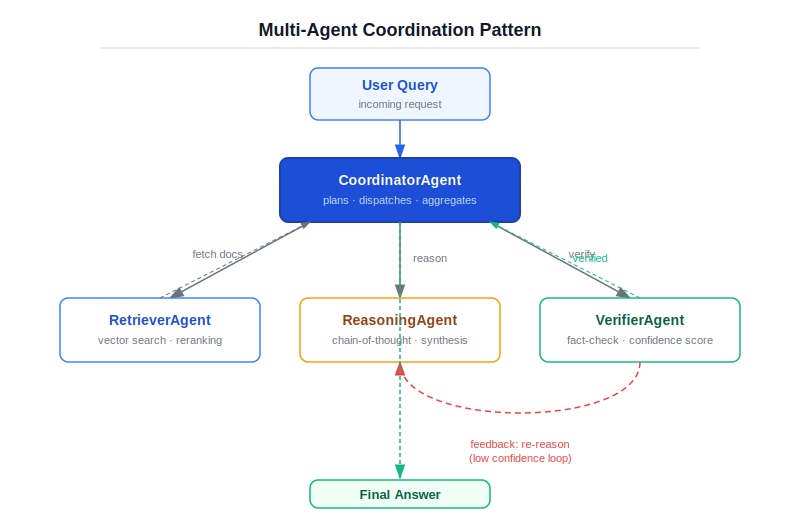
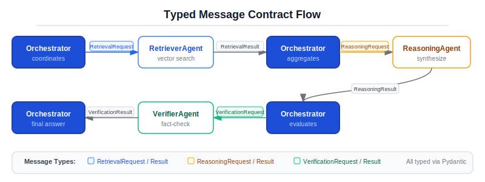
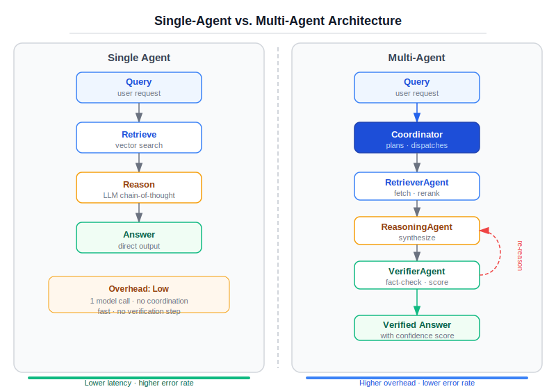
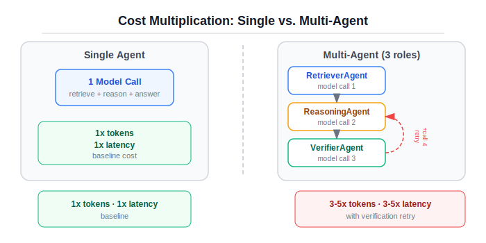

# Chapter 4: Multi-Agent Systems Without Theater

## Why this matters

Chapter 3 ended with a question: "I know when to use a single agent. But when do I actually need multiple agents -- and how do I keep them from turning into distributed confusion?"

That question carries weight because multi-agent systems are where the gap between demo and production is widest. A conference talk shows five agents collaborating in a beautifully orchestrated pipeline. It looks impressive. What you do not see: the coordination failures at 2 AM, the cost that scales with the square of agent interactions, the debugging session where you trace a wrong answer through four agents and cannot determine which one introduced the error.

Multi-agent is not inherently wrong. It is a specific tool for specific problems -- problems where a single agent genuinely cannot hold the entire task in its scope. The issue is that teams reach for multi-agent as a first instinct rather than a last resort. They decompose tasks into agents because the decomposition looks clean on a whiteboard, not because a single agent actually failed.

This chapter draws the line. We take the document intelligence task from Chapter 3 and implement a multi-agent variant: a retriever, a reasoner, and a verifier working through an orchestrator. Then we run both versions side by side and ask the only question that matters: does the multi-agent version produce better results? If so, by how much, and at what cost?

The answer is not always yes. That is the entire point.

## When multi-agent is justified

There are three legitimate reasons to split work across multiple agents, and they are more specific than most people acknowledge.

### Specialization that a single prompt cannot capture

A single agent works when one system prompt can adequately frame the task. The bounded agent from Chapter 3 searches documents and synthesizes answers -- one prompt covers both activities because they share the same context and reasoning mode.

Multi-agent becomes justified when the subtasks require fundamentally different reasoning postures. Searching for evidence is pattern matching against an index. Synthesizing an answer from evidence is compositional reasoning with attribution. Verifying that citations actually support claims is adversarial scrutiny -- the verifier's job is to find holes. These three reasoning modes benefit from different system prompts, different temperature settings, and different evaluation criteria.

The key test: could you write one system prompt that handles all the subtasks well? If yes, a single agent suffices. If you find yourself cramming contradictory instructions into one prompt -- "be creative but also be critical," "generate freely but also verify rigorously" -- that tension is a signal that the task should be decomposed.

### Independent verification

A single agent that both generates and checks its own output is marking its own homework. It has the same biases in both modes. A separate verifier agent operates from a different prompt, a different context window, and potentially a different model. It provides genuinely independent scrutiny.

This is the strongest justification for multi-agent in practice. Not decomposition for efficiency, but decomposition for integrity. The verifier in our system (`VerifierAgent` in `src/ch04_multiagent/agents.py`) receives the answer and the source evidence, and its only job is to find unsupported claims. It has no incentive to defend the answer because it did not produce it.

### Parallel decomposition

Some tasks can be broken into subtasks that genuinely run in parallel. Analyzing a financial report might involve extracting key metrics, summarizing the narrative sections, and flagging risk factors -- three independent analyses on the same input. Three agents can do this concurrently, reducing latency to the cost of the slowest subtask rather than the sum of all subtasks.

Our document intelligence task is sequential (retrieve, then reason, then verify), so this justification does not apply here. That honesty matters. Do not claim parallelism as a benefit when your pipeline is inherently sequential.

## When multi-agent is theater

Multi-agent theater is what happens when teams build architectures that look impressive but add complexity without adding value. Here are the patterns.

### Org-chart agents

"We have a Manager Agent that delegates to a Research Agent and a Writing Agent." This mirrors an organizational hierarchy, not a computational need. If the Manager Agent's entire job is to receive a task and decide which other agent to call, it is a router -- a function with an if-statement. It does not need to be an agent.

Organizational decomposition is not the same as computational decomposition. Humans specialize because of cognitive limits, training, and coordination costs that do not apply to LLMs in the same way. A model does not get tired. It does not forget how to research when it starts writing. The overhead of formalizing inter-agent communication, synchronizing state, and handling failures across agent boundaries must be justified by measurable improvement, not by analogy to human teams.

### Splitting simple tasks

Three agents where one suffices is the most common form of theater. A "Query Understanding Agent" that rephrases the question, a "Search Agent" that runs retrieval, and a "Answer Agent" that synthesizes the response. Each agent makes a model call, adds latency, and introduces a failure point. A single agent with a well-crafted system prompt handles all three steps in one pass.

The signal that you are over-decomposing: if Agent B always receives the full output of Agent A as its input with no filtering or transformation, the boundary between them is not doing work. You have just inserted a message-passing layer into what should be a single context window.

### Complexity as a proxy for quality

Some teams equate architectural complexity with solution quality. More agents feels more thorough, more sophisticated, more "intelligent." This is cargo-cult engineering. The system's quality comes from the quality of its prompts, the relevance of its retrieved evidence, and the rigor of its evaluation -- not from the number of agents in the pipeline.

If you cannot articulate what specific failure mode each additional agent addresses, that agent is theater.

## Core patterns

When multi-agent is justified, the architecture needs to be deliberate. There are three patterns worth knowing.

### Coordinator-worker

One orchestrator dispatches subtasks to specialized workers and aggregates their results. This is the pattern in our implementation. The `MultiAgentOrchestrator` in `src/ch04_multiagent/orchestrator.py` manages the pipeline: retriever, then reasoner, then verifier. The orchestrator owns the flow control, the stopping conditions, and the final response assembly.

The coordinator-worker pattern works when the subtasks are sequential and the coordinator can make informed decisions about what to do next. Its weakness is centralization: the orchestrator is a single point of failure and must understand enough about each worker's domain to interpret their results.

### Critic-proposer

One agent generates a candidate output; another critiques it. If the critique identifies problems, the proposer revises. This is a special case of coordinator-worker, but the interaction pattern is different: it is a feedback loop rather than a pipeline.

Our retriever-reasoner-verifier system uses this pattern between the reasoner and verifier. The verifier critiques the reasoner's output, and if it finds issues, the orchestrator sends the reasoner back with feedback. This loop is bounded -- maximum two verification rounds -- because unbounded critic-proposer loops are a reliable way to burn through your token budget while producing marginally better output with each pass.

### Reviewer chains

Multiple agents review the same output independently, and a final agent reconciles their reviews. This is useful when you need diverse perspectives -- one reviewer checks factual accuracy, another checks tone, a third checks compliance. The reconciler resolves conflicts.

We do not use this pattern in this chapter because our task does not need it. But it appears in Chapter 9 (Compliance and Guardrails) where different policy dimensions require genuinely different evaluation criteria.



## Message contracts

Agents that communicate through untyped strings create debugging nightmares. When Agent A passes a result to Agent B as a freeform string, and Agent B produces an unexpected output, you cannot tell whether A sent the wrong information or B misinterpreted it. The boundary between agents becomes a black box.

The `src/ch04_multiagent/contracts.py` module defines typed message contracts using Pydantic models. Every inter-agent message has a type:

```python
class AgentMessage(BaseModel):
    sender: str
    recipient: str
    message_type: MessageType
    content: str
    metadata: dict[str, Any] = Field(default_factory=dict)
```

Specialized message types carry structured data:

```python
class RetrievalResult(AgentMessage):
    citations: list[Citation] = Field(default_factory=list)
    chunks_searched: int = 0
```

```python
class VerificationResult(AgentMessage):
    verified: bool = False
    issues: list[str] = Field(default_factory=list)
```

The `MessageType` enum (`TASK`, `RESULT`, `FEEDBACK`, `ESCALATION`) makes the intent of each message explicit. When you read the orchestrator's logs, you see a sequence of typed interactions, not a wall of text.

This is not over-engineering. It is the minimum structure needed to debug a multi-agent system in production. When verification fails, you can inspect the `VerificationResult` and see exactly which issues were flagged. When the reasoner re-runs with feedback, you can trace the `FEEDBACK` message back to the specific verification issues that triggered it.



### The contract trap

Typed contracts are necessary but not sufficient. The real coordination problems are semantic, not structural. The retriever returns citations with relevance scores, but the reasoner does not know what score threshold means "good enough." The verifier flags "unsupported claim" but the orchestrator does not know whether that means "minor paraphrase difference" or "completely fabricated."

These semantic gaps are where multi-agent systems fail in practice. The contracts give you structural integrity -- the right fields, the right types. But the interpretation of those fields across agent boundaries requires careful design and, critically, evaluation.

## The working example

Our multi-agent document intelligence system has three agents coordinated by an orchestrator.

### The retriever

`RetrieverAgent` in `src/ch04_multiagent/agents.py` wraps the same `DocumentIndex` from Chapter 2. It receives a `RetrievalRequest` with a query and returns a `RetrievalResult` with citations. It does not make model calls -- it is a deterministic search over the vector index. This is deliberate. Not everything in a multi-agent system needs to be an LLM call.

```python
class RetrieverAgent:
    def __init__(self, index: DocumentIndex):
        self._index = index
        self.total_usage = TokenUsage()

    async def run(self, request: RetrievalRequest) -> RetrievalResult:
        citations = self._index.retrieve(request.query, top_k=request.top_k)
        return RetrievalResult(
            citations=citations,
            chunks_searched=request.top_k,
        )
```

Zero tokens consumed. The retriever is an agent in the architectural sense -- it has a role, a contract, and a communication protocol -- but it does not use an LLM. This is a design choice worth highlighting: the word "agent" does not require a model call. Some of the most reliable agents in a multi-agent system are the deterministic ones.

### The reasoner

`ReasoningAgent` receives retrieved citations and synthesizes an answer. Its system prompt is focused entirely on reasoning from evidence:

```
You are a reasoning agent. Your job is to synthesize an answer
from the provided evidence excerpts.

Rules:
- Only use information from the provided excerpts.
- Cite sources using [Source: filename] notation.
- If the evidence is insufficient, say so clearly.
- Be precise and concise.
```

Compare this to the single agent's system prompt from Chapter 3, which had to cover both retrieval decisions and answer synthesis. The multi-agent reasoner's prompt is narrower and more directive because it does not need to handle tool selection or search refinement. It receives evidence and reasons over it. That is its entire job.

This narrowing is the genuine value of multi-agent specialization. A focused prompt with a clear task produces more consistent output than a broad prompt that tries to cover multiple reasoning modes.

### The verifier

`VerifierAgent` receives an answer and the source evidence, then checks whether the citations are supported. Its system prompt explicitly frames its role as adversarial:

```
You are a verification agent. Your job is to check whether
an answer's citations are supported by the provided evidence.
```

The verifier returns structured JSON: a boolean `verified` field and a list of `issues`. This structured output is critical -- it lets the orchestrator make programmatic decisions about whether to accept the answer or send it back for revision.

The verifier uses `response_format={"type": "json_object"}` to constrain the model's output to valid JSON. Even so, the code includes a `json.JSONDecodeError` handler because model output is never fully predictable. A verification agent that itself produces unparseable output is a failure mode you must handle.

### The orchestrator

`MultiAgentOrchestrator` in `src/ch04_multiagent/orchestrator.py` runs the pipeline:

```python
# Step 1: Retrieve
retrieval = await self._retriever.run(
    RetrievalRequest(query=query, top_k=top_k)
)

# Step 2: Reason
reasoning = await self._reasoner.run(
    ReasoningRequest(query=query, citations=retrieval.citations)
)

# Step 3: Verify (with retry loop)
while not verified and verification_rounds < self._max_rounds:
    verification = await self._verifier.run(
        VerificationRequest(
            answer=reasoning.answer,
            cited_sources=reasoning.cited_sources,
            citations=retrieval.citations,
        )
    )
    if verification.verified:
        verified = True
    else:
        # Re-reason with feedback
        reasoning = await self._reasoner.run(
            ReasoningRequest(query=feedback_query, citations=retrieval.citations)
        )
```

Three design decisions deserve attention.

**Bounded verification loops.** The `max_verification_rounds` parameter (default 2) prevents the reasoner-verifier loop from running indefinitely. Without this bound, a strict verifier and a sloppy reasoner could loop forever, each round burning tokens without converging. This is the multi-agent equivalent of the step budget from Chapter 3: hard limits on autonomous behavior.

**Feedback propagation.** When verification fails, the orchestrator does not simply re-run the reasoner with the same input. It appends the verification issues to the query: "Previous answer had issues: [specific problems]. Please correct and re-answer." This gives the reasoner concrete guidance about what to fix, not just a signal to try again.

**Confidence adjustment.** The orchestrator adjusts the confidence score based on verification status. A verified answer gets a confidence based on retrieval quality (capped at 0.95 -- never claim certainty). An unverified answer gets a halved confidence score. This propagates the verification signal into the response, letting downstream consumers of the answer make informed decisions.

## The comparison



The `MultiAgentComparisonRunner` in `src/ch04_multiagent/compare.py` runs the single-agent implementation from Chapter 3 and the multi-agent implementation on the same queries:

```python
class MultiAgentComparisonRunner:
    def __init__(self, client: ModelClient, index: DocumentIndex):
        self._single = BoundedDocumentAgent(
            client=client, index=index, registry=ToolRegistry(), max_steps=5
        )
        self._multi = MultiAgentOrchestrator(client=client, index=index)

    async def compare(self, queries: list[str]) -> list[ComparisonResult]:
        results = []
        for query in queries:
            single_resp = await self._single.run(query)
            multi_resp = await self._multi.run(query)
            results.append(ComparisonResult(
                query=query, single_agent=single_resp, multi_agent=multi_resp
            ))
        return results
```

The `print_results` method outputs a side-by-side comparison: steps, tokens, latency, and confidence for each query, plus aggregate totals and the multi-agent overhead percentage.

### What the comparison reveals

Run this comparison on a representative set of queries and you will see patterns.

**Token overhead.** The multi-agent system uses more tokens than the single agent on every query. The minimum overhead is one additional model call (the verifier). If verification fails and the reasoner re-runs, the overhead doubles. The `print_results` output shows the total overhead as both absolute tokens and percentage. Typical range: 40-120% more tokens than the single agent.

**Latency overhead.** Every agent boundary is a sequential model call. The multi-agent system has at least two model calls (reasoner + verifier) compared to the single agent's 1-3 calls. The verification retry loop can push latency to 4-6 model calls. Since model calls are the dominant latency factor, multi-agent systems are reliably slower.

**Quality improvement -- sometimes.** The multi-agent system can produce higher-quality answers on queries where the single agent makes citation errors. The verifier catches unsupported claims and forces correction. But this benefit is query-dependent. On straightforward queries where the single agent already produces accurate, well-cited answers, the verifier adds cost without adding value.

**Escalation differences.** The multi-agent system's escalation signal is more informative. Instead of just "low confidence," it can report "verification failed after 2 rounds: specific citation issues." This richer escalation signal is valuable for human-in-the-loop systems (Chapter 5), but it comes at the cost of having run the full pipeline before escalating.

### The honest assessment

Here is where many multi-agent chapters would claim victory: "our multi-agent system catches citation errors the single agent misses." And that is true. But the honest assessment requires the full picture.

For the document intelligence task, multi-agent is a qualified win in a narrow band. It improves quality for queries where citation accuracy is critical and the single agent makes attribution errors. It does not improve quality for straightforward queries. It increases cost on every query, whether or not the quality improvement applies. And it adds operational complexity -- three agents to monitor, three sets of prompts to tune, coordination logic to debug.

The calculation: if citation accuracy is your most important quality dimension and your query distribution includes a meaningful fraction of queries where the single agent makes citation errors, the multi-agent system justifies its cost. If most queries are straightforward and citation errors are rare, the single agent with better prompting is a more cost-effective path.

Run the comparison on your actual queries. Do not rely on intuition about where multi-agent will help. Measure it.

## Coordination overhead

The cost of multi-agent goes beyond extra model calls. The coordination itself introduces failure modes that do not exist in single-agent systems.

### Shared state

In our implementation, the orchestrator is the only entity that holds the full picture. The retriever does not know what the reasoner will do with its results. The verifier does not know why the retriever selected those particular chunks. Information flows through the orchestrator, creating a bottleneck that limits how the system can evolve.

If the verifier could request additional evidence when it finds a gap -- "this claim cites Source A but I need to see Source B to verify" -- the system would be more capable. But that would require the verifier to communicate back to the retriever, bypassing the orchestrator or extending it. Every new inter-agent communication path multiplies the coordination complexity.

### Loop detection

The reasoner-verifier loop in our system is bounded by `max_verification_rounds`. But consider what happens without that bound. The verifier says "unsupported claim in paragraph 2." The reasoner fixes paragraph 2 but introduces a new unsupported claim in paragraph 3. The verifier flags paragraph 3. The reasoner fixes it but regresses paragraph 2. This is an oscillation -- the system never converges, and each round burns tokens.

Loop detection in multi-agent systems is hard because the state space is large. You are not just checking "have I seen this exact state before?" but "is this sequence of states converging or oscillating?" The pragmatic solution is what we use: a hard bound on iterations. Sophisticated approaches exist (cosine similarity between successive outputs to detect convergence) but they add complexity and are rarely worth it in practice.

### Stopping rules

When should a multi-agent system stop? Our system has a clear answer: when the verifier approves or the iteration limit is reached. But many multi-agent architectures have ambiguous stopping conditions. In a reviewer chain, do you stop when all reviewers agree? When a majority agrees? When the reconciler produces output? Each choice implies different quality and cost tradeoffs.

Ambiguous stopping rules are a reliability hazard. If the stopping condition is "when the output is good enough," you have delegated a critical system decision to a model's judgment. Define stopping rules explicitly. Make them measurable. Test them.

## Cost explosion



Multi-agent multiplies the agent tax introduced in Chapter 3. Where a single agent's overhead was 2-5x the workflow's cost, multi-agent adds another multiplier.

**Linear pipeline cost.** Our three-agent pipeline (retrieve, reason, verify) makes at minimum 2 model calls per query (reasoner + verifier). With one verification retry, that is 4 model calls. The single agent from Chapter 3 averaged 2-3 model calls. The multi-agent system's floor is close to the single agent's ceiling.

**Quadratic interaction cost.** As you add agents, the potential interactions grow quadratically. Three agents have 3 possible communication pairs. Five agents have 10. Each interaction is a potential model call. Systems with many agents and complex interaction patterns can consume 10-20x the tokens of a single agent.

**Token duplication.** Each agent receives context that overlaps with other agents' context. The reasoner receives the citations. The verifier receives the citations plus the answer. Some of those tokens are duplicated across agent calls. In a single agent, the context is assembled once. In multi-agent, similar context is assembled multiple times, and you pay for each assembly.

**The cost formula.** For a multi-agent system with N agents and R retry rounds, the rough cost is: (N + R) * average_tokens_per_call * price_per_token. For our system: (3 + R) * average_tokens * price. At scale, even small values of R (1-2 retries) make multi-agent materially more expensive.

Track this rigorously. The comparison runner outputs the total token counts and the overhead percentage. If your multi-agent system uses 100% more tokens but only produces 5% better answers, the economics do not work at scale.

## Failure modes

Multi-agent systems have all the failure modes of single agents, plus a set of coordination-specific failures.

### Blame diffusion

When the final answer is wrong, which agent is at fault? The retriever found irrelevant evidence? The reasoner misinterpreted the evidence? The verifier approved an answer it should have rejected? In a single agent, the audit trail is one sequence of steps. In multi-agent, the error could originate at any stage and propagate through subsequent stages.

Our typed contracts help with diagnosis -- you can inspect the `RetrievalResult` to check retrieval quality, the `ReasoningResult` to check answer quality, and the `VerificationResult` to check verification accuracy. But you still need to read all three to locate the root cause. Multiply this by the number of retry rounds, and debugging a single bad answer can require reading through 6-10 inter-agent messages.

### Cascade failures

When the retriever returns poor results, the reasoner struggles, the verifier flags issues, the reasoner retries with the same poor evidence, and the system exhausts its retry budget producing a low-confidence answer. The root cause was retrieval quality, but the symptom appears four steps later as a verification failure. Every agent in the chain ran correctly according to its own logic, but the system as a whole failed because the first step's output was not good enough for the pipeline to recover.

In our implementation, the orchestrator does not re-retrieve when verification fails. It re-reasons from the same evidence. This is a deliberate simplification -- adding re-retrieval would create a more capable system but also a more complex one, with new loop detection challenges (how many re-retrievals? with what queries?) and higher cost.

### Prompt interference

Each agent has a focused system prompt, which is one of the benefits of multi-agent. But the orchestrator assembles the inter-agent messages, and those messages affect each agent's behavior in ways the system prompt does not anticipate. When the reasoner receives feedback like "Previous answer had issues: unsupported claim about revenue figures," it might over-correct and remove all mentions of revenue, even supported ones. The feedback, intended to improve accuracy, instead degrades completeness.

This interference is hard to catch in unit tests because it depends on the specific content of inter-agent messages. It shows up in evaluation as intermittent quality degradation on retry rounds.

### Verification false positives

The verifier can flag supported claims as unsupported. This happens when the model's interpretation of "supported by the evidence" differs from yours. A claim that paraphrases the source material might be flagged because the verifier expects exact textual correspondence. A numerically equivalent statement (e.g., "nearly half" vs. "47%") might be flagged because the verifier does not perform arithmetic.

False positives trigger unnecessary retry rounds, burning tokens without improving quality. In our system, this is bounded by `max_verification_rounds`, but each false-positive-triggered retry wastes tokens equal to a full reasoner + verifier cycle.

## Evaluation

Evaluating multi-agent systems requires evaluating both the individual agents and the aggregate behavior.

### Agent-level evaluation

Each agent should be testable in isolation. The retriever's evaluation is standard information retrieval: precision, recall, and relevance of returned chunks. The reasoner's evaluation is answer quality given perfect evidence: if you feed it known-good citations, does it synthesize an accurate answer? The verifier's evaluation is classification accuracy: given answers with known citation issues, does it correctly identify them?

Testing agents in isolation lets you identify which agent needs improvement without running the full pipeline. If the verifier has a high false-positive rate, tune its prompt or try a different model. If the reasoner consistently misattributes sources, refine its citation instructions.

### Pipeline-level evaluation

The aggregate system can behave differently than the sum of its parts. A retriever with 80% precision and a reasoner with 90% accuracy on good evidence do not produce a pipeline with 72% accuracy. The interaction effects -- how the reasoner handles the 20% of poor evidence, how the verifier handles the reasoner's errors -- are non-linear and must be measured end-to-end.

The comparison runner provides the framework. Run both single-agent and multi-agent on a labeled test set where you know the correct answers. Compare not just accuracy but also cost-adjusted accuracy: accuracy per thousand tokens spent.

### Verification effectiveness

The verifier is the multi-agent system's distinctive feature. Measure its value directly:

- What fraction of verifier rejections are justified (the original answer was genuinely wrong)?
- What fraction of verifier approvals are correct (the answer truly is well-cited)?
- How much does verification improve answer quality compared to the same pipeline without verification?

If the verifier's rejections are mostly false positives, it is adding cost without adding value. If its approvals are unreliable, it is providing false assurance. Either failure undermines the justification for the multi-agent architecture.

## Production notes

### Cost management

At production scale, multi-agent cost is a line item that demands attention. Strategies:

**Conditional multi-agent.** Use the hybrid approach from Chapter 3: run the single agent first, and only invoke the multi-agent pipeline when the single agent's confidence is below threshold. This gives you multi-agent quality where it matters and single-agent cost where it does not.

**Model tiering.** Not every agent needs the same model. The retriever does not use a model at all. The verifier can often work with a smaller, cheaper model since its task (classification) is simpler than the reasoner's task (synthesis). Use your most capable (and expensive) model only for the agents that need it.

**Caching verification results.** If the same answer-evidence pair appears multiple times (common in systems with repeated queries), cache the verification result. Verification is expensive and often deterministic for the same inputs.

### Reliability

**Timeout per agent.** Set timeouts on individual agent calls, not just on the overall pipeline. If the reasoner hangs, the orchestrator should time out and either retry or escalate rather than blocking indefinitely.

**Circuit breakers.** If one agent fails repeatedly, the system should degrade gracefully rather than retrying indefinitely. A circuit breaker that bypasses verification after N consecutive verifier failures lets the system continue producing unverified answers rather than producing nothing.

**Observability.** Log every inter-agent message with timestamps, token counts, and the message type. In production, you need to answer questions like "what is the 95th percentile latency of the verification step?" and "what fraction of queries trigger verification retries?" These questions require per-agent telemetry, not just pipeline-level metrics.

### Security

Multi-agent systems expand the attack surface. Each agent's system prompt is a potential injection target. If the retriever returns adversarial content from indexed documents, that content flows to the reasoner's context and potentially to the verifier's context. A prompt injection that survives three agent boundaries is unlikely but not impossible.

Treat inter-agent messages as untrusted input. The orchestrator should validate the structure of agent responses (which our typed contracts enforce) and apply content-level sanitization where appropriate. This is especially important when any agent's input includes user-provided or externally-sourced content.

## Further reading

- **"Building Effective Agents"** -- Anthropic's engineering guide on agent patterns. Includes a clear framework for when multi-agent is appropriate.
- **"AutoGen: Enabling Next-Gen LLM Applications via Multi-Agent Conversation"** by Wu et al. -- The paper behind Microsoft's AutoGen framework. Useful for understanding the research direction, though the framework itself is more complex than most production tasks require.
- **"Communicative Agents for Software Development"** by Qian et al. -- The ChatDev paper that demonstrates a multi-agent system for code generation. Good example of where multi-agent decomposition adds genuine value (different software development roles require different reasoning).
- **"Society of Mind"** by Marvin Minsky -- Not about LLMs, but the foundational text on multi-agent cognition. The insight that intelligence emerges from the interaction of simple agents is prescient. The caution: emergence is hard to engineer and harder to debug.

## What comes next

You have now seen multi-agent systems built honestly -- with typed contracts, bounded loops, a clear orchestrator, and a side-by-side comparison that quantifies the cost of coordination. You know when multi-agent adds genuine value (specialization, independent verification) and when it is theater (org-chart agents, splitting tasks that one agent handles fine).

But this chapter surfaced a tension that runs through every architecture we have built so far. The single agent from Chapter 3 can be wrong. The multi-agent system is more expensive and still not always right. The verifier helps, but it can have false positives and false negatives. None of these systems are reliable enough to operate without oversight.

That raises the question at the heart of Chapter 5: if agents can be wrong and multi-agent systems are expensive, how do you keep a human in the loop without killing the automation value? How do you design the handoff so that human oversight improves quality without becoming a bottleneck that negates the point of automation?
