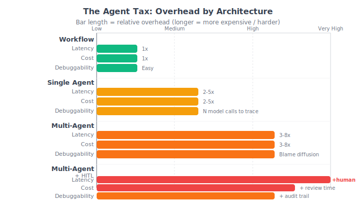
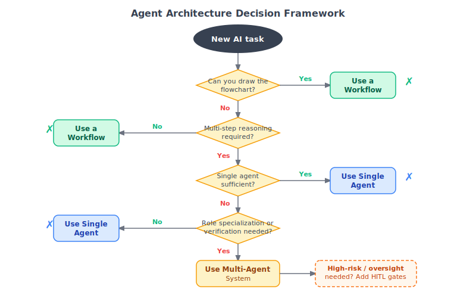
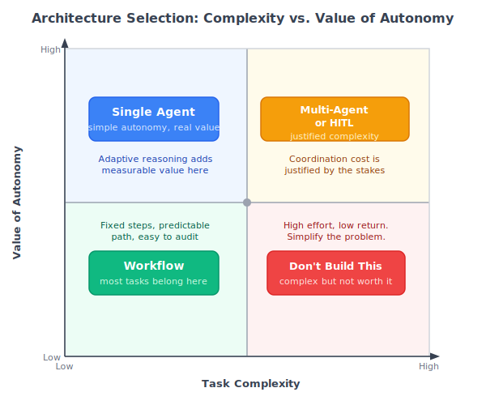

# Chapter 7: When Not to Use Agents

## Why this matters

This is the chapter most books on agents would not include. The entire trajectory of the book -- building tools, composing an agent loop, comparing architectures, evaluating and hardening -- has been moving toward more capability, more sophistication, more autonomy. It would be natural to end with "and now you can build agents for everything."

That would be dishonest.

The most valuable skill an engineer can develop is knowing when not to use a powerful tool. A database engineer who reaches for a distributed database for every project is not senior. A systems engineer who deploys Kubernetes for a single-process application is not pragmatic. And an AI engineer who builds an agent when a workflow would suffice is not being thorough -- they are creating unnecessary risk, cost, and complexity.

This chapter is about the decision not to build an agent. It is about recognizing the specific conditions under which autonomy adds value, and the much broader set of conditions under which it does not. It is about building the judgment that turns a capable engineer into a trustworthy one.

## The agent tax

Every agent system pays a tax that simpler architectures do not. Understanding this tax in concrete terms is the foundation for deciding whether to pay it.

**Cost tax.** An agent makes multiple model calls per request. In Chapter 3, we measured 2-5x more tokens for the agent versus the workflow on the same queries. At scale, this is the difference between a viable product and one that bleeds money. The cost is not just the tokens -- it is the infrastructure to track, monitor, and govern those costs.

**Latency tax.** Multiple sequential model calls mean multiple round trips. Each step adds 1-3 seconds. A 5-step agent interaction takes 5-15 seconds. For user-facing applications, this is often unacceptable. For batch processing, it multiplies throughput requirements.

**Reliability tax.** More steps mean more points of failure. Each model call can timeout, rate-limit, or return garbage. Each tool call can fail. The probability of at least one failure in a 5-step interaction is dramatically higher than in a 1-step interaction. You need retry logic, checkpointing, and graceful degradation -- all of which add code complexity.

**Testability tax.** Agent behavior is non-deterministic and path-dependent. The same query can produce different step sequences across runs. Testing requires statistical evaluation over many cases, not deterministic assertions. Your CI pipeline goes from "run tests, check pass/fail" to "run evaluation suite, check aggregate metrics against thresholds." This is harder to build, slower to run, and more nuanced to interpret.

**Debuggability tax.** When a workflow produces a wrong answer, you trace one model call. When an agent produces a wrong answer, you trace N model calls, M tool calls, and the decision chain that led to each one. You need structured tracing (Chapter 6) just to make debugging feasible.

**Governance tax.** For regulated industries, you must explain what the system did and why. A workflow's explanation is trivial: "it retrieved these documents and generated this answer." An agent's explanation requires reconstructing its decision tree from traces. Auditors and compliance teams are not impressed by capability. They are reassured by simplicity.

The agent tax is not a reason to never build agents. It is a reason to build them deliberately, with clear justification for why the tax is worth paying. If you cannot articulate the specific capability the agent provides that a simpler system cannot, you should not pay the tax.

The chart below shows the relative overhead each architecture imposes across latency, cost, and debuggability. Green bars represent low overhead; red bars represent high overhead. The rightmost column adds the human review time that HITL introduces on top of the compute overhead.



## Alternatives that are usually sufficient

Before reaching for an agent, exhaust these simpler alternatives. Each one handles a set of problems that people commonly build agents for, without the agent tax.

### Workflows

Covered in depth in Chapter 3, but worth revisiting here with different examples.

**Invoice processing.** A common "agent" use case that is almost always a workflow. The steps are known: extract vendor name, extract amounts, extract dates, validate against purchase orders, route for approval. Each step can use an LLM, but the sequence is fixed. There is no decision about what to do next. An agent would add overhead without adding capability.

**Content moderation.** Classify the content, check against policy rules, flag or approve. The steps are fixed, the logic is deterministic, and the LLM's role is classification within each step. Making this an agent -- where the model decides what to check next -- adds unpredictability to a system that needs to be auditable and consistent.

**Report generation.** Gather data from sources, format into sections, generate summaries per section, compile. The structure is known in advance. The LLM generates text within each section, but the control flow is the programmer's.

The pattern: if you can draw the flowchart before you see the input, it is a workflow. Agents are for tasks where the flowchart depends on what you discover along the way.

### Rules engines

Many tasks that look like they need "intelligence" actually need conditional logic. A rules engine evaluates conditions and applies actions. No LLMs, no tokens, no latency.

**Routing.** "If the question is about billing, route to the billing team. If it is about technical support, route to engineering." This is a classifier, not an agent. Train a small model or use keyword matching. Response time: milliseconds. Cost: effectively zero.

**Escalation.** "If confidence is below 0.6 or the query contains keywords X, Y, Z, escalate to a human." This is a rule, not a reasoning task. The confidence score comes from your system; the escalation logic is deterministic.

**Validation.** "If the extracted amount is greater than $10,000, require manager approval." A rules engine checks this in microseconds. An agent checking this by "reasoning" about the amount is using a nuclear reactor to light a candle.

The question to ask: does this decision require understanding natural language in a way that cannot be captured by conditions and patterns? If yes, you might need an LLM (though probably a classifier, not an agent). If no, a rules engine is faster, cheaper, more predictable, and easier to audit.

### Retrieval-only systems

Many "agent" systems are actually retrieval systems with a generation step. The user asks a question, the system finds relevant passages, and the system returns the passages (possibly with a generated summary). This is a workflow, and often the generation step is optional.

**Documentation search.** The user wants to find the relevant section of a manual. Returning the top-3 relevant chunks with highlighted keywords is faster, cheaper, and more trustworthy than having an agent "reason" over the chunks and produce a synthesized answer. The user can read the original text and judge for themselves.

**Legal research.** Finding relevant precedents and statutes. The value is in surfacing the right documents, not in an LLM's interpretation of them. Lawyers need citations they can verify, not synthesized conclusions from a system they cannot examine.

**Internal knowledge bases.** When employees search for company policies or procedures, they usually want the source document, not an AI's paraphrase of it. The retrieval is the product. Generation adds risk (hallucination) without proportional value.

The question to ask: does the user need the system to reason over the retrieved content, or do they need the system to find the right content? If finding is sufficient, skip the generation. If reasoning is needed, a single-step workflow (retrieve then generate) usually suffices. If the reasoning requires multiple passes with different queries -- then you might need an agent.

### Classifiers

Many agent systems are elaborate ways to do classification. The agent "analyzes" input and "decides" which category it belongs to. This is a classification task. Use a classifier.

**Intent detection.** "The user wants to return a product" / "The user wants to track an order" / "The user wants to cancel a subscription." Fine-tune a small model. Response time: under 100ms. Cost: negligible. Accuracy: often higher than a general-purpose LLM because the classifier is specialized.

**Sentiment analysis.** Positive, negative, neutral. A fine-tuned classifier or even a rule-based system outperforms an LLM agent for this task on every dimension: speed, cost, consistency, and testability.

**Triage.** Assigning priority or routing to incoming requests. This is classification with a domain-specific label set. Build a classifier, not an agent.

The question to ask: is the system's primary job to assign a label from a known set? If yes, use a classifier. Agents are for open-ended tasks where the output space is not enumerable.

### Human-in-the-loop with LLM assistance

Sometimes the right architecture is a human doing the task, with an LLM providing suggestions. This is not a cop-out. It is a legitimate system design that combines the model's breadth with the human's judgment.

**Medical report analysis.** The LLM highlights relevant findings and suggests possible interpretations. The doctor makes the diagnosis. The LLM's role is to surface information, not to decide.

**Contract review.** The LLM identifies clauses that deviate from standard terms. The lawyer reviews the flagged clauses and makes the legal judgment. The LLM accelerates the human's work without replacing the human's accountability.

**Code review.** The LLM identifies potential bugs, style violations, and missing tests. The engineer reviews the suggestions and decides which to act on. The LLM's output is advisory, not authoritative.

In these cases, building an autonomous agent is not just unnecessary -- it is actively harmful. The stakes are too high for unsupervised autonomous decisions, and the humans in the loop have expertise that the model lacks. The right system design amplifies the human rather than replacing them.

## A decision framework

Here is a structured approach to deciding which architecture a task needs. The framework covers the full spectrum from workflow through HITL-augmented agents, and each step is a gate that must be passed before escalating to the next level of complexity.

### Step 1: Can you draw the flowchart?

If you can specify the steps before seeing the input, it is a workflow. Build a workflow (Chapter 3). The test is not whether the task is complex -- complex workflows with many steps are still workflows. The test is whether the steps are known in advance. Stop here if the answer is yes.

### Step 2: Does the task require multi-step reasoning with intermediate decisions?

If completing the task requires finding information and then using that information to decide what to look for next, that is a reason for a single agent. But be honest: does it really require this, or are you imagining edge cases that represent 5% of the query volume? If 95% of queries follow a predictable path, build a workflow with human escalation for the 5%, not an agent for the 100%.

### Step 3: Have you measured the workflow's limitations?

Build the workflow first. Run it on your actual queries. Measure where it fails. If it fails on 30% of queries because single-pass retrieval is insufficient, you have data justifying a single agent. If it fails on 3%, consider handling those with human escalation rather than building an agent for all queries. The hybrid approach from Chapter 3 -- workflow by default, agent for low-confidence cases -- is often the right answer at this step.

### Step 4: Does the single agent need independent verification?

If citation accuracy, factual grounding, or adversarial scrutiny matters for your domain, test whether the single agent's errors are systematic in ways that a different reasoning posture would catch. If a separate verifier agent with a focused prompt catches errors that the single agent's self-correction does not, the multi-agent architecture from Chapter 4 may justify its overhead. But measure the verification effectiveness: what fraction of verifier rejections are genuine catches versus false positives? If the false positive rate is high, the verification is adding cost without adding value.

### Step 5: Does the task involve high-risk actions or require auditability?

If the agent takes actions with real-world consequences (executing remediation, modifying data, communicating with customers), add HITL controls from Chapter 5. The question is not whether to add human oversight -- for high-risk domains, the answer is always yes. The question is where in the pipeline the human gate belongs and how the escalation policy is calibrated. Use the three requirements: the reviewer has the information, the review is timely, and the reviewer can reject or modify.

### Step 6: Is the total system cost justified by the total system value?

This is the aggregate check. Add up the compute cost (tokens per query times volume), the human cost (reviewer time per escalation times escalation rate), the engineering cost (building, testing, maintaining, debugging the system), and the operational cost (monitoring, incident response, compliance). Compare against the value the system produces. If a simpler architecture produces 90% of the value at 30% of the cost, the simpler architecture wins.

### The decision tree, summarized

```
Can you draw the flowchart in advance?
  Yes -> Workflow (Chapter 3)
  No  -> Does it need multi-step adaptive reasoning?
           No  -> Workflow + human escalation for edge cases
           Yes -> Build single agent (Chapter 3)
                  Does it need independent verification?
                    No  -> Single agent is sufficient
                    Yes -> Multi-agent with verifier (Chapter 4)
                  Does it involve high-risk actions?
                    No  -> Deploy with evaluation (Chapter 6)
                    Yes -> Add HITL controls (Chapter 5)
                           Calibrate escalation thresholds
                           Monitor approval fatigue indicators
```

The diagram below visualizes the same decision process. Each diamond is a gate: pass it with evidence before proceeding to the next level of complexity. The HITL annotation (dashed orange) is not a separate branch -- it applies as an overlay to any architecture that touches high-risk actions.



This framework is deliberately conservative. It assumes the simplest architecture is the default and each step toward complexity must be justified by measured evidence. The right side of the tree is not better than the left side. It is more expensive, more complex, and harder to operate. You move right only when the left side provably cannot meet your requirements.

## Systems that should not have been agents

These are composite examples drawn from patterns seen across the industry. They illustrate the mismatch between the agent pattern and the actual problem.

### The "agent" that always follows the same path

A company built a customer support agent that follows this sequence: classify the query, look up the customer's account, check for known issues, generate a response. The agent had tools for each step and a loop that called them in order.

The agent always called the same tools in the same order. It never skipped a step. It never went back to re-classify after seeing the account. It never decided that a different approach was needed.

This was a workflow wearing an agent costume. The agent loop added latency (3x slower than a fixed pipeline), cost (2.5x more tokens), and unpredictability (occasionally the model decided to skip the account lookup step, producing a generic response). Replacing the agent with a workflow improved response time, reduced cost, and eliminated the random skipping behavior.

The lesson: if the agent's decisions are predictable, you do not need an agent to make them. Write the decisions in code.

### The multi-agent system for a single-agent task

A team built a three-agent system for document analysis: a "planner" agent that decomposed the query, an "executor" agent that ran the search and extraction, and a "reviewer" agent that checked the answer. Each agent had its own system prompt, tool set, and model calls.

The planner's decomposition was almost always the same: "search for relevant information and extract the answer." The reviewer almost always approved the executor's answer. The system made 8-12 model calls per query, with most of the tokens spent on inter-agent communication (the planner's plan, the executor's report, the reviewer's assessment).

A single agent with a 5-step budget produced equivalent quality with 3-4 model calls. The three-agent architecture added coordination complexity, made debugging harder (which agent was responsible for a bad answer?), and cost 3x more.

The lesson: do not decompose into agents when tool decomposition within a single agent works. Agent boundaries should correspond to genuinely different capabilities or expertise, not to steps in a process.

### The agent that reinvented grep

A startup built an "intelligent code analysis agent" that searched codebases for patterns, analyzed the results, and produced reports. The agent used tools for file search, content extraction, and pattern matching.

The core operation -- finding files matching a pattern and extracting relevant sections -- is what grep, ripgrep, and language server protocols do. The LLM's contribution was formatting the results into a human-readable report. The "intelligence" in the system was 95% traditional text search and 5% LLM summarization.

Replacing the agent with a script that ran the searches and used a single LLM call to format the results produced the same output quality at 1/10th the cost and 1/20th the latency.

The lesson: before building an agent, check whether the task's core operations are already solved by existing tools. If the LLM's role is primarily formatting or summarization of results obtained by conventional means, use a workflow with a single generation step.

## Multi-agent anti-patterns

Chapter 4 built a multi-agent document intelligence system and ran it side by side against the single agent. The comparison was instructive, but the lessons extend beyond that specific task. There are recurring anti-patterns in multi-agent design that waste engineering effort and compute budget while adding no measurable value.

### The org chart as architecture

This is the most seductive anti-pattern because it feels intuitive. "We have a product team with a researcher, a writer, and an editor. Let's build a Researcher Agent, a Writer Agent, and an Editor Agent." The decomposition mirrors the human organization, which makes it easy to explain to stakeholders.

But human organizations decompose tasks based on human constraints -- limited working memory, different skill sets acquired over years, the need for rest and handoffs. LLMs do not share these constraints. A single model can research, write, and edit within one context window. Splitting these into separate agents means passing partial results through serialization boundaries, duplicating context across multiple calls, and introducing coordination failures that do not exist when one model handles the full task.

The test from Chapter 4 applies: could you write one system prompt that handles all the subtasks well? If the decomposition mirrors job titles rather than genuinely incompatible reasoning modes, it is org-chart thinking, not architectural thinking.

### Three agents where one would suffice

Chapter 4 documented this pattern in detail. A "planner" that always produces the same plan, a "worker" that executes it, and a "reviewer" that almost always approves. The pipeline makes 8-12 model calls where 3-4 would produce equivalent output.

The telltale sign is stable agent behavior. If you log the planner's output across 100 queries and it produces the same decomposition structure for 90 of them, the planner is not planning -- it is performing a ritual. Replace it with a static template. If the reviewer approves 95% of outputs without modification, the reviewer is not reviewing -- it is wasting tokens. Remove it and use evaluation (Chapter 6) to catch quality issues in a batch process rather than per-request.

The comparison data from Chapter 4 is unambiguous on this point. The multi-agent system's token overhead ranged from 40% to 120% more than the single agent, with quality improvements that were query-dependent and sometimes negative (the verification loop introduced its own error modes). The multi-agent system justified itself only in the narrow band where citation accuracy mattered and the single agent made attribution errors. For everything else, the single agent was more cost-effective.

### Coordination overhead exceeding task complexity

Every agent boundary creates coordination cost: serializing and deserializing messages, potentially duplicating context, handling timeouts and failures at each boundary, and debugging across boundaries when something goes wrong. When the coordination overhead exceeds the complexity of the underlying task, you have over-decomposed.

A practical heuristic: if the inter-agent messages are longer than the useful work each agent does, the boundaries are in the wrong place. In Chapter 4, the orchestrator assembled context for the reasoner, then assembled nearly the same context for the verifier, paying for much of the same token content twice. This duplication is inherent to the multi-agent pattern. For simple tasks, the duplication dominates the useful computation.

## The human-in-the-loop cost calculus

Chapter 5 built the machinery for human-in-the-loop oversight: approval gates, escalation policies, and audit logs. The Incident Runbook Agent demonstrated these primitives in a production-relevant context. But HITL has its own cost structure that must be evaluated honestly, because poorly designed HITL can be worse than no human oversight at all.

### When the human overhead exceeds the automation value

The point of an agent is to automate decisions that would otherwise require human effort. HITL adds human effort back into the loop. If the HITL overhead approaches or exceeds the effort of just having humans do the task directly, the agent is not providing net value -- it is providing complexity.

Consider a document classification agent that escalates 40% of cases to a human reviewer. The reviewer spends an average of 2 minutes per escalation. At 1,000 documents per day, the agent auto-classifies 600 and sends 400 to humans. If the human can classify a document in 3 minutes without the agent, the manual approach takes 50 person-hours per day. The agent-plus-HITL approach saves 30 hours of classification (the 600 auto-classified documents) but adds 13 hours of review (400 escalations at 2 minutes each), plus the agent's compute cost, plus the engineering cost of maintaining the approval pipeline. The net savings is 7 hours minus infrastructure costs. Whether that is worth it depends on the numbers, not on whether the architecture is "agentic."

The escalation rate is the critical variable. Chapter 5's `EscalationPolicy` gives you the knobs to control it, but the knobs need calibration against the cost model, not just against accuracy.

### Approval fatigue

Chapter 5 covered this directly, but it is worth restating as a decision factor. When a reviewer sees 50 approval requests per hour and approves 49 of them, they stop reading. The approval step becomes reflexive rather than deliberative. The system has HITL on paper but not in practice.

The fix is not more diligent reviewers. The fix is fewer, higher-quality escalations. The `auto_approve_threshold` in Chapter 5's `ApprovalPolicy` is the primary lever. If your reviewer approves 95% of escalations, the threshold is too conservative -- raise it until the approval rate drops to 70-80%, where the human is exercising genuine judgment rather than performing a ceremony.

But there is a subtlety. If you raise the threshold too aggressively, you reduce escalation volume but also increase the rate of unreviewed errors. The optimal point depends on the cost of missed errors versus the cost of reviewer time. For the Incident Runbook Agent, where a missed error might mean an incorrect remediation on production infrastructure, the optimal threshold is more conservative than for a content classification agent where a missed error means a document goes into the wrong folder.

### When HITL is security theater versus genuine oversight

Chapter 5 identified the three requirements for genuine oversight: the reviewer has the information to evaluate the decision, the review happens within a time window where it is still actionable, and the reviewer has the authority and mechanism to reject or modify. If any one is missing, the HITL is theater.

The decision framework should include a HITL theater check. Before adding an approval step, ask: who will review this, how quickly, and with what information? If the answer is "an on-call engineer who gets a Slack notification and clicks approve between other tasks," that is not oversight. If the answer is "a domain expert who reviews the agent's proposed action with full context and has a 5-minute SLA," that is genuine oversight.

The audit log from Chapter 5 provides the data to distinguish theater from oversight after deployment. Track approval latency (are reviews happening in seconds, suggesting rubber-stamping, or in minutes, suggesting deliberation?), rejection rate (are reviewers ever rejecting, or just approving everything?), and modification rate (are reviewers adjusting agent proposals, indicating engaged review?). If approval latency is under 10 seconds, rejection rate is under 1%, and modification rate is zero, your HITL is theater regardless of what the architecture diagram says.

## An honest retrospective on the Document Intelligence Agent

Throughout this book, we built the Document Intelligence Agent in four configurations: as a deterministic workflow (Chapter 3), as a bounded single agent (Chapter 3), as a multi-agent system with retriever, reasoner, and verifier (Chapter 4), and with HITL approval gates (the patterns from Chapter 5 applied to the same task). Here is an honest assessment of the full spectrum.

### The workflow (Chapter 3)

The workflow is a three-step pipeline: retrieve, build context, answer. One model call per query. Predictable cost, predictable latency, easy to test and debug. It handles 70-80% of queries well -- straightforward lookups where the first retrieval pass finds sufficient evidence.

Where it fails: ambiguous queries where the user's terminology does not match the documents, multi-part questions requiring synthesis across topics, and cases where the retrieval step returns low-quality evidence. These failures are bounded and measurable. The workflow knows when it is struggling (low relevance scores, low confidence) and can escalate.

### The single agent (Chapter 3)

The bounded agent adds a loop: retrieve, assess, optionally re-retrieve with a refined query, then answer. 2-5 model calls per query. It recovers about 15-20% of the cases where the workflow fails, primarily through query refinement on ambiguous queries and multi-step retrieval on multi-part questions.

Where it fails: budget waste on straightforward queries (the extra steps add cost without improving the answer), questions with no answer in the corpus (the agent searches fruitlessly before escalating), and decision quality degradation as the context grows noisier with each step.

### The multi-agent system (Chapter 4)

The retriever-reasoner-verifier pipeline adds independent verification. 2-6 model calls per query depending on verification retries. It catches citation errors that the single agent misses, because the verifier scrutinizes the answer from a different prompt and context window.

Where it fails: token duplication across agents (the reasoner and verifier both receive the citations), verification false positives that trigger unnecessary retries, coordination complexity that makes debugging harder (blame diffusion across three agents), and cost overhead of 40-120% over the single agent regardless of whether the verification adds value for a given query.

### With HITL (Chapter 5 patterns)

Adding approval gates to any of the above architectures introduces human judgment at decision points. The Incident Runbook Agent is the clearest example: the agent proposes, the escalation policy decides whether a human should review, the approval gate routes to a reviewer, and the audit log records everything.

Where it helps: high-risk actions where the cost of a wrong decision exceeds the cost of human review latency, regulatory domains where a decision trail is required, and early deployment where trust in the agent has not been established. Where it hurts: routine decisions where the human adds no value (approval fatigue), time-sensitive operations where the human review latency exceeds the response window, and when the reviewer lacks the context or expertise to make a better decision than the agent.

### Which approach wins for this task?

The honest answer is: it depends on the deployment context, and no single architecture dominates.

For a general-purpose document QA system with diverse queries: the **hybrid approach from Chapter 3** -- workflow by default, single-agent escalation for low-confidence cases. This captures 90% of the value at the lowest cost.

For a system where citation accuracy is critical (legal, medical, compliance): the **multi-agent system with verification** from Chapter 4, accepting the higher cost as the price of independent scrutiny.

For a system operating in a regulated environment or handling high-stakes decisions: the **HITL-augmented agent** from Chapter 5, with the specific architecture (workflow, single-agent, or multi-agent) chosen based on the quality requirements and the escalation policy calibrated based on observed error rates.

For a system with predictable, well-structured queries: the **workflow alone**. No agent, no multi-agent, no HITL. The simplest architecture that meets the quality bar is the right one.

The progression through this book was not a march toward the "best" architecture. It was an expansion of options, each with a different cost-quality tradeoff. The skill is not knowing the most complex option. It is knowing which option fits the constraints you actually have.

## When autonomy genuinely adds value

Lest this chapter read as anti-agent, here are the conditions where autonomy is the right choice.

**Open-ended research tasks.** When the user asks a question and you genuinely do not know what information will be needed or where it will be found, an agent's ability to search, assess, and search again is valuable. Research assistants, competitive analysis, and literature review are good agent candidates.

**Multi-system orchestration.** When the task requires interacting with multiple external systems (databases, APIs, file systems) and the sequence of interactions depends on intermediate results, an agent's decision-making is useful. But verify that the sequence is genuinely data-dependent, not just long.

**Adversarial or dynamic environments.** When the task involves navigating a changing environment where the right action depends on observations that cannot be predicted -- game playing, interactive testing, adaptive negotiation -- agents are the right tool.

**Tasks where exploration has value.** When trying multiple approaches and comparing results is better than committing to one approach -- creative tasks, optimization, hypothesis testing -- the agent's loop provides the structure for exploration.

Notice the common thread: the task requires decisions that depend on intermediate observations that cannot be predicted at design time. If the decisions can be predicted, use a workflow. If they cannot, use an agent. This is the simplest, most reliable heuristic for the build/do not build decision.

The quadrant below maps task complexity against the value that autonomy adds. Most tasks cluster in the bottom-left -- they belong in a workflow. Only in the top-right, where complexity and autonomy value are both genuinely high, does the full overhead of multi-agent systems or HITL become justified.



## The cost of getting it wrong in each direction

**Building an agent when you need a workflow** is the more common mistake. The costs: higher per-request expense, slower responses, harder testing, more complex operations, and an architecture that is harder to explain and audit. The benefit: none, because the agent is not using its autonomy for anything the workflow cannot do.

**Building a workflow when you need an agent** is less common but also costly. The costs: the system cannot handle the cases that require adaptive reasoning. Users hit these cases and get poor results or escalations that require human intervention. The benefit: simpler, cheaper system for the cases it handles well.

The asymmetry is important. Building an agent when you need a workflow costs you on every request. Building a workflow when you need an agent costs you only on the requests the workflow cannot handle. This is why "workflow first, agent second" is the safer default. The downside of starting simple is bounded. The downside of starting complex is unbounded.

## Principles for the decision

1. **Start with the simplest architecture that could work.** LLM app before workflow. Workflow before tool-using system. Tool-using system before agent. Agent before multi-agent. Move right only when you have measured evidence that the current architecture is insufficient.

2. **Measure before you move.** Do not add autonomy because you think you need it. Add it because you have run evaluation and the current system fails on a specific, quantified set of cases that the more complex architecture handles.

3. **Account for the full cost.** Not just the token cost, but the engineering cost of building, testing, operating, debugging, and governing the more complex system. A system that costs 3x more to run and 5x more to maintain needs to be 8x more valuable.

4. **Evaluate continuously.** The decision is not permanent. Your query distribution will change. Your document corpus will change. Your model provider will update their models. Re-run the comparison periodically. What was an agent-worthy task last quarter may be a workflow task this quarter (because retrieval improved) or vice versa (because the query distribution shifted).

5. **Design for demotion.** Build your agent so that the agent loop can be disabled, leaving a workflow. This lets you A/B test, fall back during incidents, and re-evaluate the decision without a rewrite. The `ComparisonRunner` in Chapter 3 shows this structure: both implementations share components and differ only in the orchestration layer.

6. **Respect the humans.** For high-stakes decisions, the right amount of autonomy is often "suggest, do not decide." The LLM surfaces information and proposes actions. The human reviews and approves. This is not a failure of automation. It is appropriate system design for tasks where the cost of a wrong autonomous decision exceeds the cost of a human review step.

## Further reading

- **"Do You Need an Agent?"** (Chip Huyen) -- A practical framework for evaluating whether a task needs agentic architecture. Independently arrives at many of the same conclusions as this chapter.
- **"Simple Made Easy"** (Rich Hickey, 2011) -- Not about AI, but the best articulation of why simplicity is a feature, not a compromise. The talk is 60 minutes well spent for anyone building complex systems.
- **"An Opinionated Guide to LLM Frameworks"** -- Compares the complexity and abstraction tradeoffs of major LLM frameworks. Useful for understanding what frameworks hide and whether that hiding helps or hurts your specific use case.
- **The original RAG paper** (Lewis et al., 2020) -- Worth reading to understand how much capability a non-agentic retrieval-augmented system provides. Many tasks attributed to "agents" are actually well-scoped RAG systems.

## Closing

This book started with a taxonomy and ends with a judgment call. The seven chapters form a progression: understand what agentic means (Chapter 1), build the components (Chapter 2), compare workflow versus agent (Chapter 3), push into multi-agent territory (Chapter 4), add human oversight (Chapter 5), harden and evaluate the system (Chapter 6), and decide when to use each approach (this chapter).

The Document Intelligence Agent was the vehicle for this progression. We built it as a workflow. We built it as a bounded agent. We built it as a multi-agent system with independent verification. We wired in approval gates and escalation policies. We evaluated all of them. And we concluded that for this task, the right answer depends on the deployment context -- not on which architecture is most impressive, but on which one fits the constraints you actually have.

Your task will be different. Your documents will be different. Your query distribution will be different. Your risk tolerance will be different. The specific answer will be different. But the process -- build simple, measure, add complexity only when justified, measure again -- is universal.

The engineers who build the most durable, trustworthy AI systems will not be the ones who build the most sophisticated agents. They will be the ones who know when a workflow is enough, when an agent earns its overhead, when multi-agent coordination adds genuine value, and when human oversight is essential rather than ceremonial. That judgment -- earned through building, measuring, and comparing -- is what separates serious engineering from impressive demos.
